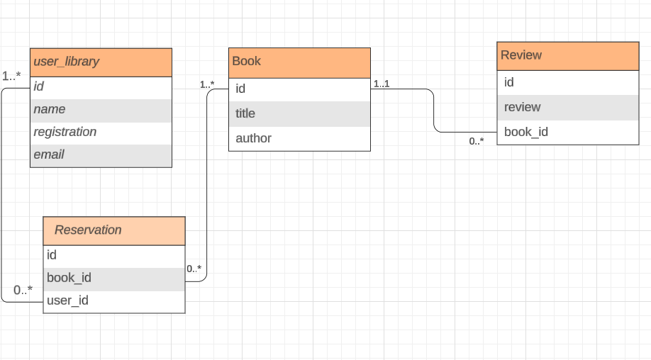

# online-library

## Description
This project is a simple online library that allows you to manage books and authors. It is a simple project that uses spring boot, spring data, PostgresDB, Redis for caching and spring observability.

## Database model

## How to Run the Project
Follow these steps to run the project locally:

### Prerequisites
- Docker
- Maven (for running with ./mvnw)

1. Clone the project
2. Start external Dependencies:
    > Run `docker-compose up` to start the database and prometheus
3. Run the project:
    > with `./mvnw spring-boot:run` or using your IDE
4. Access the project at `http://localhost:8080`
5. You can access swagger-ui documentation at `http://localhost:8080/swagger-ui/index.html`
6. This application is monitored by prometheus, you can access at `http://localhost:9090`